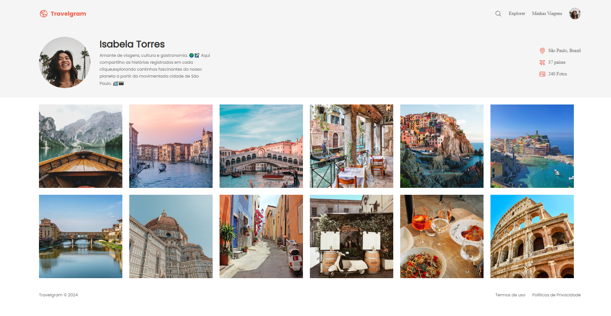

# Travelgram

📌 Projeto pronto para deploy no GitHub Pages

**Visualização online:** [Adicione aqui o link do GitHub Pages](https://seu-usuario.github.io/seu-repositorio)

## Sobre
Projeto de página estática de perfil de viagens, feito com HTML e CSS. O objetivo é mostrar um layout simples e visual para um perfil de viajante com navegação, foto, cards de informação e galeria de imagens.

## Tecnologias
- HTML5
- CSS3

## Como executar
1. Clone este projeto ou copie os arquivos para sua máquina.
2. Abra o arquivo `index.html` no navegador.
3. Opcional: use Live Server no VS Code para visualizar localmente.

## Estrutura de pastas
- `index.html` — página principal
- `styles/index.css` — arquivo principal de estilo
- `styles/global.css` — estilo global e variáveis
- `styles/nav.css` — estilo do menu de navegação
- `styles/header.css` — estilo da seção de perfil
- `assets/Logo.svg` — logotipo
- `assets/icons/` — ícones usados na interface
- `assets/images/` — imagens do perfil e galeria

## Funcionalidades
- Cabeçalho com logo e menu
- Seção de perfil com foto, nome e descrição
- Informações de localização, países e fotos
- Galeria de imagens

## Projeto Finalizado

